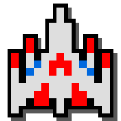
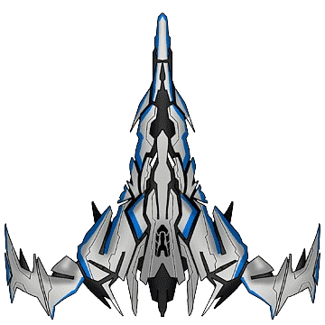

    <h1>🚀 GALAGA EN PYTHON 👾</h1>
        
<em>Una recreación del clásico juego arcade desarrollada con Python</em>

      

    
    

      
## 🎮 Características del Juego
      
- 🛸 **Control de Nave:** Usa las flechas del teclado para moverte
- 🔫 **Sistema de Disparo:** Presiona la barra espaciadora para disparar
- 👽 **Enemigos Dinámicos:** Enfréntate a oleadas de alienígenas
- 🏆 **Sistema de Puntuación:** Compite por el puntaje más alto
- 🌟 **Niveles Progresivos:** La dificultad aumenta con cada nivel
      
## 🕹️ Cómo Jugar
      
1. Usa las flechas ⬅️➡️⬆️⬇️ para mover tu nave
2. Presiona <kbd>Espacio</kbd> para disparar
3. Elimina enemigos para ganar puntos
4. Evita colisionar con los enemigos
5. ¡Sobrevive el mayor tiempo posible!
      
## 🛠️ Tecnologías Utilizadas
      

    
     
    

## 🎨 Gráficos

El juego utiliza imágenes personalizadas para la nave del jugador y los enemigos:

- `Nave.PNG`: Representa la nave del jugador
- `Enemigos.png`: Representa a los enemigos

Estas imágenes se encuentran en la carpeta `assets`.

## 🕹️ Controles Adicionales

- Presiona <kbd>Enter</kbd> en el menú principal para iniciar el juego
- Presiona <kbd>Esc</kbd> en el menú principal para salir del juego

## 🌟 Características Adicionales

- **Disparos Enemigos:** Los enemigos también disparan, ¡cuidado con sus balas!
- **Aumento de Dificultad:** El juego se vuelve más desafiante a medida que avanzas:
  - La velocidad de los enemigos aumenta con cada nivel
  - Se añaden más enemigos cada 10 enemigos eliminados
- **Pantalla de Game Over:** El juego termina si tu nave colisiona con un enemigo o es alcanzada por una bala enemiga

## 🛠️ Estructura del Código

El juego está organizado en varias clases principales:

- `Jugador`: Controla la nave del jugador
- `Enemigo`: Maneja el comportamiento de los enemigos
- `Bala`: Representa los disparos del jugador
- `BalaEnemiga`: Representa los disparos de los enemigos

## 📊 Sistema de Puntuación y Niveles

- Gana 1 punto por cada enemigo eliminado
- El nivel aumenta cada 10 enemigos eliminados
- El puntaje y el nivel actual se muestran en la pantalla de juego

## 📈 Desarrollo Futuro
      
- [ ] Implementar power-ups
- [ ] Añadir efectos de sonido y música
- [ ] Crear un sistema de vidas
- [ ] Diseñar niveles de jefe
      
## 👨‍💻 Autor
      

    <strong>Nicolás Posada García</strong>
    
Desarrollador de Software | Entusiasta de los Videojuegos

        
        

     
    
🎮 ¡Disfruta jugando Galaga en Python! 🎮

